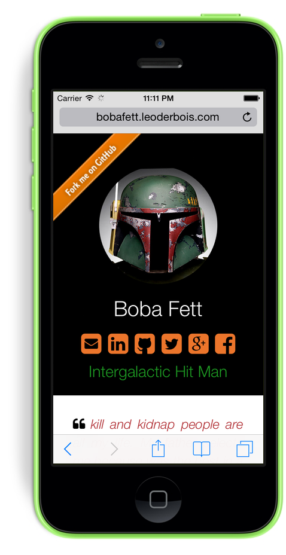

Boba Fett Theme For Jekyll 1.3
==========================

A **Resume Theme for [Jekyll](http://jekyllrb.com)** oriented for developpers. All the magic of this theme is that **sections fill via Markdown** files. 

> It makes your resume such as Boba Fett.

Desktop | Mobile
-------|--------
| 

## How to use it

### General informations

There is three files to customize your site : 

- ` _config.yml` for customizing your **informations** (name, summary, twitter, linkedin...),
- `css/main.scss` for customizing the **desgin** (fonts, colors, sizes...),
- `CNAME` for your custom domain.

All sections of the resume are filled with your **markdown** post in `_posts`.
 
### Quick start

#### get it :

- download **[sources file](https://github.com/leoderbois/Boba-Fett-Theme-For-Jekyll/archive/gh-pages.zip)** or **[clone](https://github.com/leoderbois/Boba-Fett-Theme-For-Jekyll/fork)**, customize it and run Jekyll on your server,
- [**fork the gh-pages branch**](https://github.com/leoderbois/Boba-Fett-Theme-For-Jekyll/fork) to a new project of your github (best choice). And *Pull* it on your computer.

#### Customize

- customize `_config.yml`with your informations,
- customize `css/main.scss` (Jekyll now support SASS)
- or if you don't want to use `.less` change the `css/main.css`.

#### Start your server

- intstall Jekyll : [jekyllrb.com](http://jekyllrb.com/) *(if needed)*,
- go to the folder where is your resume/theme with your **terminal**,
- start your server : `jekyll serve -w --baseurl ''`,
- go to [http://localhost:4000](http://localhost:4000).

## Exemples of site using this template

- [Boba Fett Resume](http://bobafett.leoderbois.com)
- [Léo Derbois resume](http://www.leoderbois.com)

> [tell me](mailto:contact@leoderbois.com) if you use my theme 😊 

## Development

#### There is 2 statics branches :

- `gh-pages` for the [demo](http://bobafett.leoderbois.com), [to download](https://github.com/leoderbois/Boba-Fett-Theme-For-Jekyll/archive/gh-pages.zip) and [to fork](https://github.com/leoderbois/Boba-Fett-Theme-For-Jekyll/fork),
- `develop` for improvements and fixes,

#### This project use **Frameworks** : 

- [Jekyll](http://jekyllrb.com) 
- [Boostrap](http://getbootstrap.com) (included, nothing to do)
- [sass](http://sass-lang.com) (Included in Jekyll, nothing to do)
- [Font Awesome](http://fortawesome.github.io/Font-Awesome/) (included, nothing to do)

## Todo

- Nothing scheduled.

**[Contact me](mailto:contact@leoderbois.com) if you have ideas !**

## Releases notes

#### 1.0

- First stable release

#### 1.1

- more fonts to custom (panel, titles, posts)
- new **custom category** with custom name

#### 1.2

- add Open Graph options (title,local, description)
- add Google site verification and Alexa

#### 1.3

- change css preprocessor for SASS, which is included in Jekyll now

## License

Open sourced under the [MIT license](/LICENSE.md).

